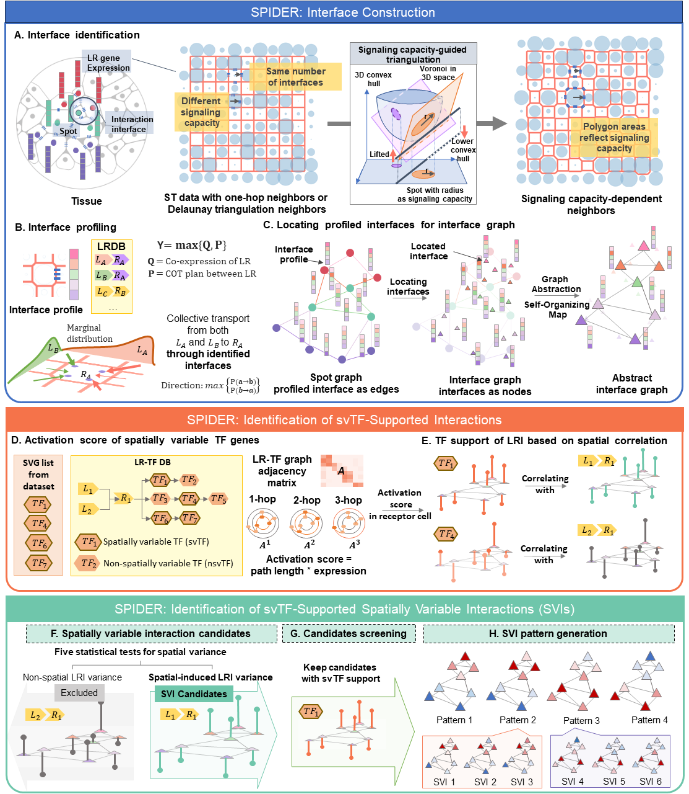

.. spider-st documentation master file, created by
   sphinx-quickstart on Mon Apr 17 13:43:05 2023.
   You can adapt this file completely to your liking, but it should at least
   contain the root `toctree` directive.

SPIDER: SPtial Interaction-encoDed intErface decipheR
==========================================================================

SPIDER constructs cell-cell interaction interfaces with minimized Dirichlet energy, models interface profiles with knowledge-graph-informed interaction signals, and identifies spatially variable signals with multiple probabilistic models.

.. toctree::
   :maxdepth: 2
   :caption: General

   Installation
   API

.. toctree::
   :maxdepth: 2
   :caption: Tutorials

   tutorials

